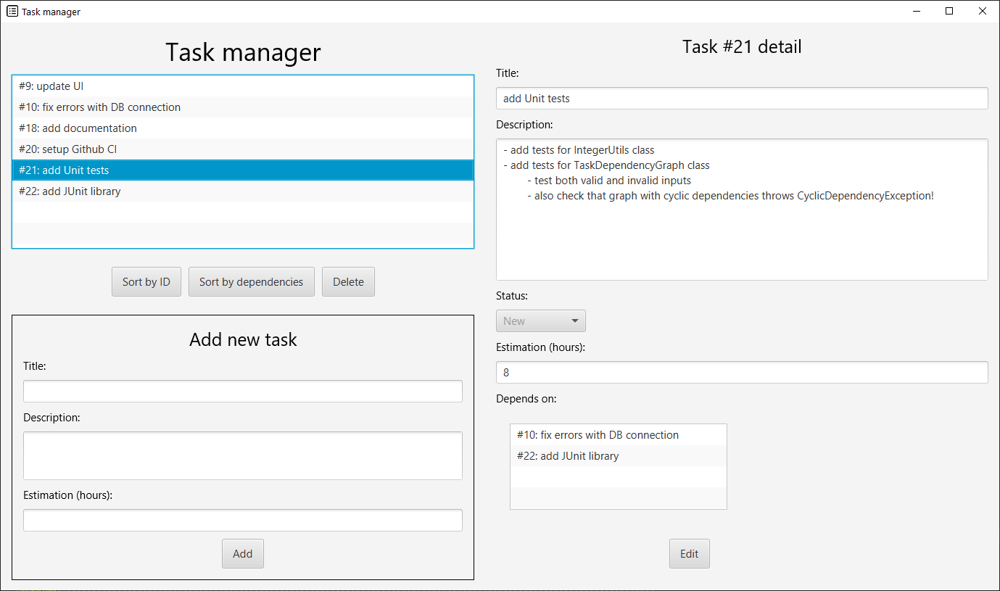

# Task Manager
## Introduction
This repository contains a desktop app for task management, which can be used for any type of tasks/activies that you're doing/plan to do.
More specifically, the program allows you to
- list all the tasks
- add new tasks
- delete tasks
- update task properties
- manage dependencies between tasks (e.g. you can set that Task #1 depends on Task #2 i.e. completing Task #2 is prerequisite for completing Task #1)

Each task contains the following properties:
- ID - unique identifier of the task
- title
- description
- estimation (estimated time in hours for completing the task)
- status (New, In Progress or Completed)
- its dependencies (other tasks)

The app is developed using JavaFX and the data are stored in SQLite database (program automatically creates file **database.db** in the root directory).

## Usage
### Requirements
- JDK 15
- Maven

### Run
The app is multi-platform, you just need to run
```shell
> mvn javafx:run
```
in the root directory.

There are example data in [example_data.sql](example_data.sql) file. You can insert these data into the database (file database.db) 
using [SQLite Command line shell](https://sqlite.org/cli.html) or [GUI](https://sqlitebrowser.org/) - just copy-paste the SQL script.
Then click on "Sort by Id", which reloads data from the database or restart the app.\
**Make sure that you haven't created any tasks before that** (example data contain hard-coded task IDs). If you had, **delete the database (file database.db), restart the 
app and run the SQL again.**\
If the database file doesn't exist, run the app, it will create it automatically.

## UI & Functionality




The UI is divided vertically into 2 halves. The left half contains list of all active tasks (at the top) and form for creating a new task (at the bottom).
 - Tasks in the list are displayed in the following format: `#{taskId}: {taskTitle}` (e.g. `#2: Clean the room` means, that the `ID = 2` and `title = "Clean the room"`).
 - If you want to delete a task, just select it in the list, click on "Delete" button and confirm it.
 - You can also select how to order the tasks (either by ID or by dependencies). Sort by dependencies means that tasks are ordered in a way, 
 that for every task: all of the dependencies are located above it. So, you can start completing tasks one by one from the top. 
 If there are multiple possible orderings (for example in the case with no dependencies), the program selects arbitrarily.
 - To add a new task, just fill the form fields and click on "Add". New task will be created and added to the list.
 Also note that you **can't set the dependencies while creating the task! You have to create it without dependencies and then set the dependencies in Task Details section 
 (see below for details).**

After you click on any task from the list, *task detail* section appears on the right. This section displays the task properties and its dependencies 
(displayed in the box at the bottom). If it's empty, it means that the task has no dependencies.
- to edit the properties, click on "Edit" button. Now you're able to change the properties and add/remove dependencies.
- to add a dependency, select the task from the dropdown next to "Add" button and click on "Add"
- if you want to delete a dependency, select it from the box and click on "Delete"
- after you're finished with the updates, click OK/Cancel to confirm/rollback the changes.
- **if the status is set to completed, the task will be removed from the list!**
- if there are any problems (such as cyclic dependencies), error dialog is displayed and the changes are taken back
